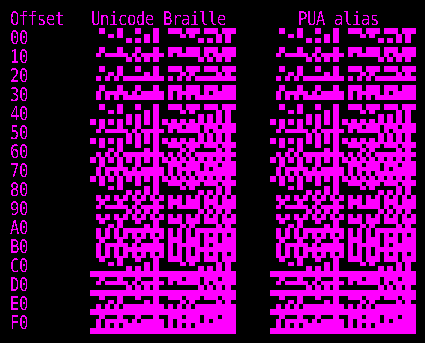

# Square Braille Unicode Text Seamless

A programmatically generated monospaced terminal font that turns the official
Unicode Braille Patterns block into a seamless 2×4 square-pixel canvas.

The recommended font contains:

- normal text suitable for an interactive shell;
- square Braille at official Unicode `U+2800–U+28FF`;
- identical compatibility aliases at PUA `U+E000–U+E0FF`;
- a 500-unit character advance and 1000-unit em;
- 60 units of controlled exterior overfill to suppress raster seams.



## Quick start

Download or clone the repository, then follow the guide for your system:

- [Linux quick start](docs/QUICKSTART-LINUX.md)
- [macOS quick start](docs/QUICKSTART-MACOS.md)
- [Windows quick start](docs/QUICKSTART-WINDOWS.md)

The recommended file is:

```text
fonts/current/Square-Braille-Unicode-Text-Seamless.ttf
```

Install either the TTF or OTF, not both. TTF is recommended for terminal use.

## Verify the build

With Python and FontTools installed:

```sh
python3 src/font/verify_unicode_braille.py \
  fonts/current/Square-Braille-Unicode-Text-Seamless.ttf \
  fonts/current/Square-Braille-Unicode-Text-Seamless.otf
```

The verifier proves that every official Braille codepoint and its PUA partner
map to the same glyph, and checks the text and terminal metrics.

## Repository map

```text
fonts/current/       Recommended Unicode + PUA font
fonts/legacy/        Preserved earlier font generations
src/font/            Generators and verification programs
scripts/             User-level installers and terminal setup
demos/basic/         Snow, starfield, trail, triangle and probes
demos/vector/        Vector tunnel and space demonstrations
demos/3d/            Parametric and external-mesh rendering engines
docs/                Quick starts and engineering record
config/              VROBI PUA mapping
```

The chronological design and validation history is documented in
[Architecture and history](docs/ARCHITECTURE.md).

## External assets and licensing

Normal text outlines derive from DejaVu Sans Mono under the included
[Bitstream Vera / DejaVu license](LICENSE-DejaVu.txt).

No project-wide open-source license has yet been selected. Until the repository
owner adds one, the remaining original code and assets are not implicitly
licensed for redistribution or modification.

Third-party spacecraft meshes and derived geometry caches are deliberately not
included. See [Third-party assets](docs/THIRD-PARTY-ASSETS.md).

