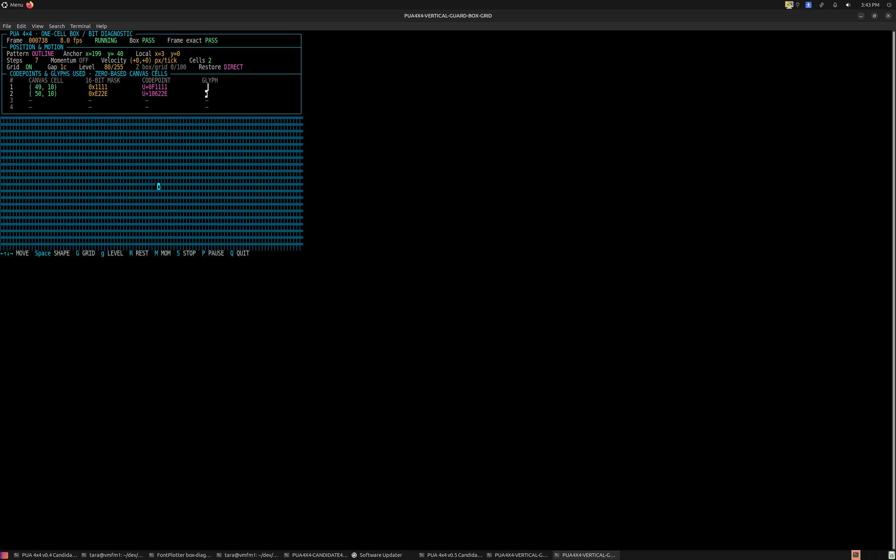
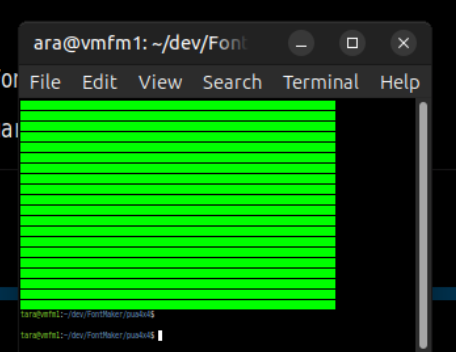
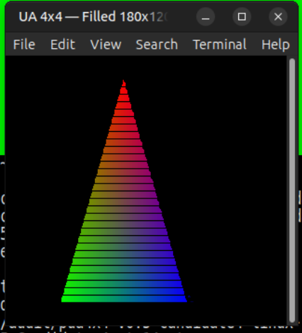

# PUA 4x4 Candidate 6 evidence — v0.6 RC1

> This is the current Candidate 6 evidence record. For the complete project
> context, operational boundaries and next work, see the
> [zero-context handover](handover/README.md).

## Decision

Candidate 6 is the selected Linux release candidate for normal and enlarged
MATE Terminal sizes. It replaces Candidate 4 as the default but does not
overwrite it.

The decision is deliberately bounded: horizontal seams can still appear at
MATE Terminal's two smallest Ctrl-minus zoom levels. Those extreme sizes are
outside this candidate's supported visual range.

## Invariants retained

Candidate 6 does not alter the approved mathematics:

```text
bit = 4 * local_y + (3 - local_x)

mask < 0x8000:  codepoint = U+0F0000 + mask
mask >= 0x8000: codepoint = U+100000 + (mask - 0x8000)
```

Full occupancy is still the foreground glyph for mask `0xFFFF` at
`U+107FFF`. There is no blank-glyph/background substitution and no reverse
video.

## Exact derivation

Candidate 6 is generated from the preserved Candidate 4 binaries. It retains:

- every cmap entry;
- every advance width (`500` font units);
- every x coordinate (`0..500`), so horizontal ownership remains strict;
- every internal 4x4 boundary;
- Candidate 4's TrueType grid-fitting instructions.

Only two exterior y coordinates change:

```text
bottom exterior: -200 -> -300
top exterior:     800 ->  900
```

The generated manifest records:

| Check | Part 0 | Part 1 |
|---|---:|---:|
| glyphs with changed exterior y points | 32,512 | 32,768 |
| changed points | 147,456 | 180,224 |
| changed x coordinates | **0** | **0** |

This is a vertical-only guard. It cannot reproduce Candidate 3's horizontal
cross-cell overwrite because no x point crosses the emitting cell.

## Logical ownership evidence

The real FontPlotter framebuffer-service diagnostic was run locally and on the
Linux target. Both runs returned `status: PASS` with:

- outline mask `0xF99F`;
- solid mask `0xFFFF`;
- corner mask `0x9009`;
- one-virtual-pixel movement;
- grid underlay restored after movement;
- box present in DIRECT, PLOT-Z and OR modes;
- exact composite restored in DIRECT mode.

The actual Linux MATE Terminal was then opened with Candidate 6's fonts. The
box was moved across terminal-cell boundaries over the grid. The dashboard
continued to report `Box PASS` and `Frame exact PASS`, and the grid did not
press into the box.



## Field and triangle evidence

At normal and enlarged sizes, the stacked full-mask field and RGB triangle are
visually continuous. This is the practical size range used by the demos and
FontPlotter.

At the second-to-last extreme Ctrl-minus reduction, MATE Terminal again exposes
horizontal rows between stacked cells:





That limitation is size-dependent terminal rasterisation. The mapping,
codepoint, glyph selection and framebuffer masks do not change with zoom.

## Reproducibility

```bash
cd ~/dev/FontMaker/pua4x4
python3 make_v06_candidate6_vertical_guard.py
./install-linux-v06-candidate6.sh

# Supported visual checks
./launch-linux-v06-candidate6.sh field
./launch-linux-v06-candidate6.sh triangle
./launch-linux-v06-candidate6.sh box
```

Earlier candidates remain selectable:

```bash
PUA4X4_USE_V05_RC1=1 ./launch-linux.sh triangle
PUA4X4_USE_V04_RC1=1 ./launch-linux.sh triangle
PUA4X4_USE_V03=1 ./launch-linux.sh triangle
```

## Binary identities

```text
Part 0  2a473fc9fab1d1399fd46a04f85b9ff04a97962500a05d67c9677cb5bfe999af
Part 1  f023c3f4c74b69858b2a8083479589166d11c0562b6afe7261263127eb43dfe0
```
