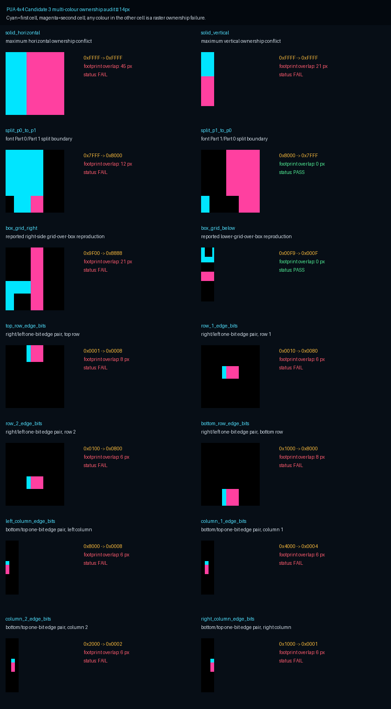
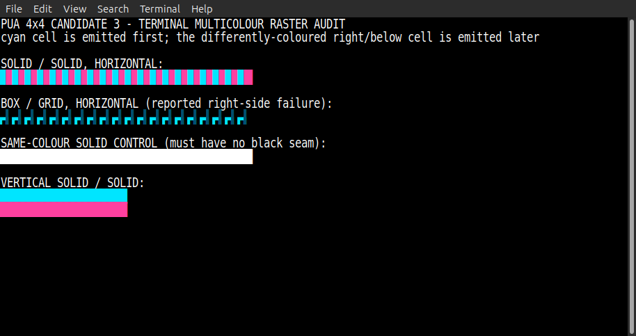
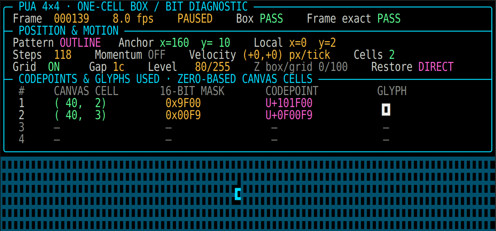
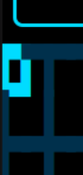
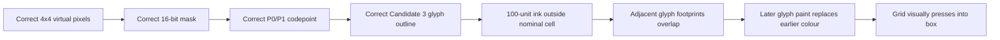

# PUA 4x4 v0.4 Candidate 3 — full raster audit

Date: 2026-08-14
Status: **Candidate 3 fails the multi-colour/depth-safe release gate**
Scope: bit mathematics, codepoint mapping, all 65,536 outlines, actual Pango/Cairo rasterization, and MATE Terminal output

> **2026-08-14 continuity-test correction:** the original Candidate 1 control
> counted black pixels in the complete Pango image, including one exterior
> line-box row outside the glyph ink. It did not locate black pixels at the
> internal join. The corrected bounding-box criterion shows Candidate 1 and
> Candidate 4 have zero internal black pixels in all 20 foreground solid-field
> controls. This correction does not change Candidate 3's ownership failure:
> its declared 100-unit outline overhang still produces direct, measured
> cross-cell footprint overlap in 360/420 tests.

## Decision first

The screenshots showing the grid pressing into the box are real terminal-rendering defects. They are not evidence of an incorrect virtual-pixel formula, an incorrect codepoint, or a corrupt framebuffer mask.

Candidate 3 made same-colour fields seamless by extending every active exterior subpixel 100 font units beyond its terminal cell. That ink is not clipped to the cell. When the adjacent cell has another foreground colour, Pango/Cairo and MATE Terminal paint the later glyph over the earlier glyph. The later grid cell can therefore obscure the box edge even though the framebuffer still contains the correct box mask.

Candidate 3 must remain preserved as evidence, but it must not be treated as a general-purpose, multi-colour/depth-safe release.

| Gate | Result | Evidence |
|---|---:|---|
| MSB-left bit formula | PASS | All 65,536 masks sampled at all 16 logical subcell centres |
| P0/P1 codepoint formula and coverage | PASS | All 65,536 required codepoints found in the correct part |
| One terminal-column advance | PASS | 65,536/65,536 glyphs retain advance width 500 |
| Candidate 3 declared transform only | PASS | 65,536/65,536 glyph coordinate streams match Candidate 1 after the documented transform |
| Same-colour seamlessness | PASS | 60/60 size, direction, and antialias controls have zero black pixels |
| Multi-colour raster ownership | **FAIL** | 360/420 tests have adjacent-cell footprint overlap; all 360 applicable opposing-edge cases fail |
| Exact-core Candidate 1 ownership control | PASS | 0/140 footprint overlaps with antialias disabled |
| Exact-core Candidate 1 internal continuity control | PASS | 20/20 size/direction controls contain no black pixel at an internal join |
| MATE Terminal reproduction | **FAIL** | Deterministic terminal capture and supplied diagnostic captures reproduce the overwrite |

## The invariant being tested

The framebuffer owns a colour and depth result for each virtual pixel. Four-by-four virtual pixels are encoded as one 16-bit mask and emitted as one terminal glyph.

For that ownership to survive terminal rendering:

> Raster ink emitted for terminal cell A must not occupy a device pixel also occupied by terminal cell B.

If two terminal-cell glyph footprints overlap, terminal paint order becomes an undeclared compositor. Foreground colour and depth decisions already made by the framebuffer can be replaced by whichever glyph is painted later.

This invariant is stricter than the previous seam test. A solid field can be visually seamless while still violating cell ownership, because the same colour hides the overlap.

## Layer 1 — mathematics and codepoints

For virtual pixel `(vx, vy)`:

```text
cell_x  = vx // 4
cell_y  = vy // 4
local_x = vx % 4
local_y = vy % 4

bit = 4 * local_y + (3 - local_x)
bit_value = 1 << bit
```

The local bit layout is:

```text
local x →     0    1    2    3
local y 0     3    2    1    0
        1     7    6    5    4
        2    11   10    9    8
        3    15   14   13   12
```

The complete mask is read as `fedcba9876543210`. The codepoint split is:

```text
mask 0x0000..0x7FFF → U+0F0000 + mask
mask 0x8000..0xFFFF → U+100000 + (mask - 0x8000)
```

The exhaustive audit reconstructed the logical mask by sampling the centre of every one of the 16 subcells in every glyph. Results:

- 65,536 glyphs checked.
- 65,536 logical masks matched.
- 0 mapping failures.
- 0 missing required PUA codepoints.
- 0 wrong-part selections.

Therefore the box masks displayed by the diagnostic, including `0x9F00`, `0x00F9`, `0x9009`, and `0xFFFF`, are mathematically and structurally valid.

## Layer 2 — Candidate 3 outline geometry

The nominal terminal-cell outline box is:

```text
x = 0 .. 500
y = -200 .. 800
advance width = 500
```

Candidate 3 applies this transform only to points exactly on an exterior edge:

```text
x =   0 → -100
x = 500 →  600
y = -200 → -300
y =  800 →  900
```

Internal 4x4 boundaries remain unchanged. The advance width remains 500, so the extra outline area is not allocated extra terminal space.

The exhaustive comparison found:

- 65,536/65,536 Candidate 3 coordinate streams equal the declared transform of Candidate 1.
- 61,440 glyphs (93.75%) cross the left boundary when their left edge is active.
- 61,440 glyphs cross the right boundary when their right edge is active.
- 61,440 glyphs cross the top boundary when their top edge is active.
- 61,440 glyphs cross the bottom boundary when their bottom edge is active.

For one horizontal or vertical boundary, 2,936,012,800 of the 4,294,967,296 possible ordered mask pairs—68.359375%—have at least one aligned opposing edge subpixel active. This is a geometry risk count, not a claim that every application frame uses those pairs or different colours.

## Layer 3 — actual Pango/Cairo raster audit

Environment:

- Ubuntu 24.04.4 LTS, aarch64, kernel 6.8.0-137-generic.
- Pango 1.52.1 through `pango-view` and Cairo.
- Sizes: 8, 9, 10, 11, 12, 13, 14, 16, 18, and 20 px.
- Antialias modes: none, grayscale, and subpixel.
- Directions: horizontal and vertical.
- Cases: solid, exact P0/P1 split controls, reported box/grid masks, and all 16 one-bit edge primitives.

Each ownership test renders three identical two-cell layouts:

1. first glyph only;
2. second glyph only;
3. both glyphs with different colours.

The first-only and second-only rasters are compared directly. If both glyph footprints ink the same device pixel, the test fails. This method does not assume an image midpoint or a particular rounding rule.

### Candidate 3 results

- 420 multi-colour ownership tests.
- 360 failures.
- 120/140 failures with antialias disabled.
- 120/140 failures with grayscale antialiasing.
- 120/140 failures with subpixel antialiasing.
- The 60 passes are the two deliberately non-opposing-edge controls at ten sizes and three modes.
- 60/60 same-colour solid tests pass with zero black pixels.

At the deployed 14 px size with antialias disabled:

| Case | Overlapping device pixels | Result |
|---|---:|---:|
| solid beside solid | 45 horizontal / 21 vertical | FAIL |
| P0 `0x7FFF` beside P1 `0x8000` | 12 | FAIL |
| box `0x9F00` beside right grid edge `0x8888` | 21 | FAIL |
| each horizontal one-bit opposing edge pair | 6–8 | FAIL |
| each vertical one-bit opposing edge pair | 6 | FAIL |



### Exact-core Candidate 1 control

The same ownership suite was run with the non-overfilled Candidate 1 outlines and antialias disabled:

- 0/140 footprint-overlap failures.
- 0/20 internal same-colour solid seam failures under the corrected criterion.

The earlier 16/20 count was exterior Pango surface padding, not an internal
join. The corrected control proves that exact-core geometry can satisfy both
foreground continuity and independent cell ownership. Candidate 3's overhang
is therefore unnecessary for continuity and destroys independent colour/depth
ownership.

## Layer 4 — actual MATE Terminal output

Installed Candidate 3 binaries used by the terminal:

```text
Part 0 SHA-256  94847138178994d016d3a0e315be0aa10604c1ea85e01b6d98eb8f41421ac9d8
Part 1 SHA-256  a979a9568dbe5c0b90bb54eb6bc0e4a70caf536bd4c2e791d589796a984f0ec1
MATE Terminal   1.26.1
```

Fontconfig selected the expected installed Part 0 and Part 1 files. A deterministic terminal probe then emitted:

- alternating cyan/magenta solid cells;
- cyan box masks followed by dark-teal grid masks;
- a same-colour white solid control;
- cyan solid cells followed by magenta cells on the next row.



The same-colour white field is seamless. The differently-coloured cases retain no black seam but show paint-order ownership at the boundary. The supplied interactive diagnostic gives the more obvious real-world manifestation:



At the top-left screen boundary, the later right-hand grid cell presses into the box's top-right, and the later lower row presses into its bottom-left:



## Why logical verification still says PASS

`Box PASS` and `Frame exact PASS` compare logical framebuffer state before terminal rasterization. They prove:

- the intended box pixels exist;
- the grid background was restored correctly;
- the expected 16-bit masks were encoded;
- the expected PUA codepoints were emitted.

They cannot prove that FreeType/Pango/Cairo/VTE confines a glyph's raster ink to its terminal cell. Candidate 3 violates that later-stage condition by design. Both statements can therefore be true at the same time:

```text
logical framebuffer and encoded mask: PASS
visible multi-colour terminal raster:  FAIL
```

## Root cause chain



## Release decision and next gate

No font files were changed during this audit. Candidate 1 and Candidate 3 remain preserved byte-for-byte.

Candidate 3 is suitable only when all touching cells are guaranteed to share the same foreground colour and equivalent compositing semantics. It is not suitable for the current FontPlotter requirement, where adjacent cells can carry different foreground/background colours and depth-resolved content.

Any next candidate must pass all of these gates simultaneously:

1. all 65,536 logical masks and codepoints pass;
2. all glyph advances remain one terminal column;
3. same-colour horizontal and vertical fields contain no background seam at tested sizes;
4. adjacent differently-coloured glyph footprints do not overlap;
5. the deterministic MATE Terminal box/grid probe agrees with the logical framebuffer;
6. no renderer-specific paint order is required to preserve depth or colour ownership.

Font generation should not resume until a candidate mechanism can plausibly satisfy both gates 3 and 4. Symmetric outline overfill alone cannot do so because its seam remedy is the ownership violation.

Candidate 4 subsequently tested strict Candidate 1 geometry plus explicit
grid-fitting. It passes sparse ownership, but a later real-terminal audit with
20 stacked rows proved horizontal line-box seams. The proposed
blank-glyph/background substitution was rejected because full occupancy must
remain foreground mask `0xFFFF`, codepoint `U+107FFF`. Candidate 6 retains
strict horizontal ownership and adds a vertical-only guard. See
[Candidate 6 evidence](PUA-4X4-CANDIDATE-6-EVIDENCE-v0.6.md).

## Reproduction

From the PUA 4x4 experiment directory:

```bash
# Exhaustive mask, cmap, advance, and outline-transform audit
python3 audit_multicolour_raster.py --structural-only

# Full Candidate 3 Pango/Cairo audit
python3 audit_multicolour_raster.py \
  --font 'PUA 4x4 v0.4 Candidate 3' \
  --candidate-label 'Candidate 3'

# Exact-core ownership/seam control
python3 audit_multicolour_raster.py \
  --font 'PUA 4x4 v0.4 Candidate' \
  --candidate-label 'Candidate 1 exact-core control' \
  --antialias-modes none \
  --output-dir output/audit/multicolour-raster-v0.4-candidate1-control \
  --report output/audit/pua4x4-v0.4-candidate1-control-raster-audit.json

# Interactive deterministic terminal probe
python3 terminal_multicolour_raster_probe.py --hold 90
```

## Evidence index

- Audit implementation: `experiments/pua-4x4/audit_multicolour_raster.py`
- Terminal probe: `experiments/pua-4x4/terminal_multicolour_raster_probe.py`
- Candidate 3 machine report: `experiments/pua-4x4/output/audit/pua4x4-v0.4-full-raster-audit-linux.json`
- Candidate 1 control report: `experiments/pua-4x4/output/audit/pua4x4-v0.4-candidate1-control-raster-audit-linux.json`
- Candidate 3 raster evidence: `experiments/pua-4x4/output/audit/multicolour-raster-v0.4-linux/`
- Candidate 1 control evidence: `experiments/pua-4x4/output/audit/multicolour-raster-v0.4-candidate1-control-linux/`
- Supplied terminal observations: `experiments/pua-4x4/output/audit/multicolour-raster-v0.4/observed-terminal/`
