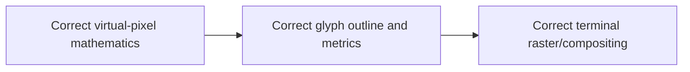

# Chronology and decision record

Dates describe the active investigation, not necessarily a tagged release.

## 2026-07-29 to 2026-07-31 — Square Braille foundation

### Request and first font

- Recreate the official 256 Braille patterns as square, equal subcells.
- Initial mapping used the BMP Private Use Area at `U+E000-U+E0FF`.
- Established a 500-unit advance, 1000-unit em and 2x4 subcell geometry.
- Added programmatic generation with FontForge/FontTools-compatible output.

### Visual validation and demonstrations

- Built HTML and terminal specimens because FontForge's glyph window did not
  make codepoint identity obvious enough.
- Created snow, starfield, interactive trail and triangle demonstrations.
- Early runs in a normal terminal displayed unrelated fallback symbols. This
  proved that installing a font does not make a terminal choose it.
- Added dedicated Linux launch/profile scripts and explicit font selection.

### First seam investigation

- Full fields and filled triangles exposed hairline character-cell fractures.
- Controlled exterior overfill reduced seams without changing the mask
  mapping.
- Colour and diagonal probes separated spacing/raster problems from animation
  or coordinate problems.

### Normal text and Unicode mapping

- A graphics-only PUA font made an interactive shell appear blank because it
  had no normal alphanumeric glyphs.
- DejaVu Sans Mono text outlines were merged to create a usable primary
  terminal font.
- The proven graphics glyphs were mapped directly to official Braille
  `U+2800-U+28FF`, retaining PUA aliases for existing programs.
- Decision: the normal-text outlines are for a convenient primary font;
  seamless graphics come from cell geometry and overfill, not from the text
  characters themselves.

## 2026-08-01 to 2026-08-03 — packaging, GitHub and macOS

- Added per-user Linux, macOS and Windows installation guidance.
- Published the public GitHub repository under the MIT license for original
  code while retaining the separate DejaVu license.
- macOS Terminal tests found point-size-dependent row seams at 9-12 pt.
- Increased the released Square Braille exterior guard from 60 to 100 font
  units. The resulting v1.4 TTF rendered seamlessly down to 8 pt in the tested
  CoreText/Terminal configuration.
- Lesson: Terminal.app zoom and profile font size are separate state; verify
  the actual PostScript font name and size of the front window.

## 2026-08-04 — PUA 4x4 concept

### Why two fonts

- A 4x4 cell has 16 binary positions and therefore `2^16 = 65,536` masks.
- One conventional TrueType font cannot safely carry that repertoire plus
  ordinary text, so it was split into two 32,768-glyph fonts.
- Supplementary-plane cmap format 12 is required.

### Mapping correction

- The first implementation used LSB-left row-major mapping.
- The user specified MSB-left rows: `3,2,1,0`, then `7,6,5,4`, etc.
- The approved formula became `4 * local_y + (3 - local_x)`.
- An interactive character editor exposed the difference visually.
- Decision: all renderers, masks, catalogs and specifications must use the
  approved formula. Older LSB-left builds remain historical only.

### Early 4x4 builds

- v0.2: historical LSB-left build.
- v0.3: corrected MSB-left mapping, but later shown to have an effective
  TrueType placement defect caused by zero left side bearings.
- Detached pixels and malformed triangle edges were not proof of bad mask
  arithmetic; exhaustive chain audits showed the cmap and formula were right,
  while bearings shifted sparse glyphs.

## 2026-08-05 to 2026-08-10 — 3-D rendering and VGR

- Ported the existing 2x4 demonstrations to 4x4 without replacing the older
  versions.
- Added Defender, vector tunnel, Elite-like battle and model flyby tests.
- Imported official NASA Voyager model data with provenance and checksum.
- Built Grand Tour scenes, camera paths, hidden-line removal and filled/wire
  modes.
- Created an Iron-Man-style capture dashboard showing frame timing, mask
  census, P0/P1 activity, compression and encounter progress.
- Created VGR v1: indexed ZIP archive containing independently compressed VGF
  packets and metadata, enabling deterministic replay without re-rendering.
- Learned that requested animation FPS and achieved offline render FPS are
  different quantities. Interactive recordings store completed redraws, so a
  long session can create a small archive when frames are expensive.

## 2026-08-08 to 2026-08-15 — bearing, ownership and seam candidates

### Candidate 3 / v0.4 RC1

- Fixed the sparse-glyph placement problem.
- Added a 100-unit guard on all exterior edges.
- Same-colour fields looked seamless.
- Full raster audit later proved that horizontal overhang lets a later glyph
  paint into a differently coloured neighbour. This violated independent cell
  ownership and could obscure a box edge even when framebuffer masks were
  correct.

### Candidate 4 / v0.5 RC1

- Preserved corrected bearings and constrained x geometry to `0..500` with
  advance 500.
- Removed horizontal overpainting and passed box/grid ownership tests.
- Real MATE Terminal stacked full-row fields exposed horizontal line-box seams
  excluded from earlier Pango bounding-box tests.

### Candidate 5 experiments

- Tested boundary hinting approaches. Retained as experimental evidence, not
  promoted.

### Candidate 6 / v0.6 RC1

- Derived reproducibly from Candidate 4.
- Kept every x coordinate, internal boundary, mapping and hint program.
- Extended only the exterior vertical edges to `-300..900`.
- Passed normal-size field, triangle and box-over-grid tests on Linux.
- Horizontal seams remain at the two smallest MATE Ctrl-minus zoom levels.
- Decision: accept as the current Linux RC with a stated supported visual
  range; do not claim universal seamlessness.

## 2026-08-11 to 2026-08-12 — renderer compositing evolution

- A single foreground colour per terminal cell caused spacecraft detail to
  collapse into solid blocks when plotted over a filled planet.
- Proposed using the rear colour as terminal background and the nearer detail
  as foreground.
- Initial changes improved spacecraft detail but rendered planetary rings in
  front because spatial/depth ordering had been lost.
- Added per-virtual-pixel depth and colour, restored ring front/back ordering,
  and introduced an error-tested two-colour cell encoder.
- VGR v2 added background RGB and flags planes so recordings preserve the
  richer cell encoding.
- Decision: full single-colour cells remain full foreground masks. Background
  is an optional reconstruction aid selected from depth-resolved rear content,
  not an alternative representation of occupancy.

## 2026-08-13 to 2026-08-14 — FontPlotter RAM service

- Split the new work into `~/dev/FontPlotter` to keep it distinct from font
  generation.
- Implemented a long-running ordinary-user service owning named framebuffers
  in RAM, addressed by separate CLI invocations.
- Per virtual pixel: occupancy byte, RGBA8888 and float32 depth (nine base
  bytes per pixel).
- Added persistent/batched IPC, atomic batches, bulk pixels, depth-aware plot,
  unconditional set, rectangle fill/erase and bounded RAM logs.
- Added protocol-v3 complete terminal-cell backups, CRUD, translated restore,
  `replace`, depth-tested `plot` and logical `or` merge policies.
- Added compact aligned 2x4/4x4 viewport encoding and terminal dump.
- Added evidence presentation, visual blitter lab, Asteroids and a one-cell box
  diagnostic.
- Decision: public operations use zero-based virtual coordinates. One-based
  ANSI cursor positions are internal rendering metadata, not public restore
  destinations.

## 2026-08-14 to 2026-08-15 — box/grid audit

- The one-cell box diagnostic exposed cases where a grid appeared to intrude
  into the box.
- Separated two checks:
  - **Box PASS**: the box's intended pixels remain present.
  - **Frame exact PASS**: the complete composited framebuffer equals the
    expected box-over-grid image.
- `replace` restores exact prior state. `plot` and `or` intentionally have
  different semantics and need not reproduce an exact prior composite.
- Candidate 3's horizontal overhang was identified as a font raster ownership
  failure, not framebuffer corruption.
- Candidate 6 normal-size visual evidence passed both box and exact-frame
  checks.

## Current historical lesson

The project repeatedly encountered a three-layer ambiguity:

A PASS at one layer does not prove the next. Every future claim must identify
which layer was tested.
