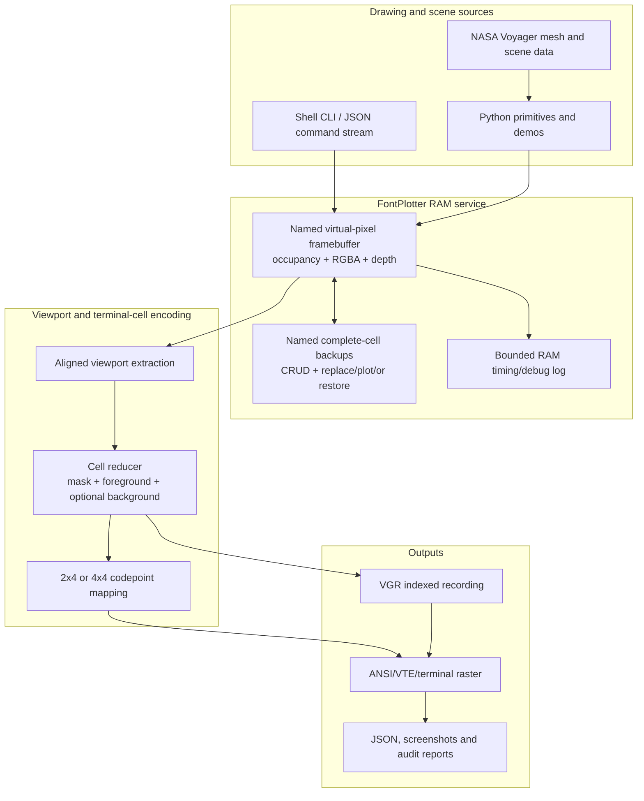
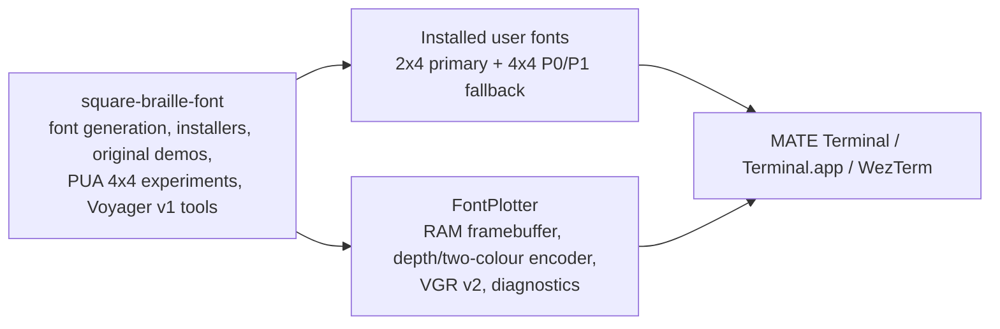
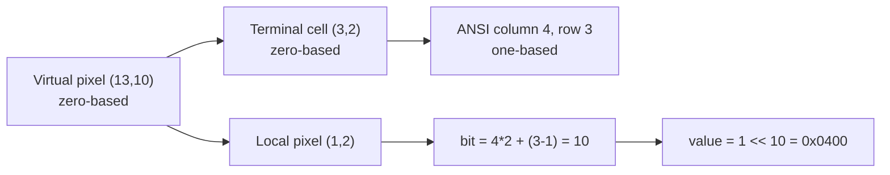
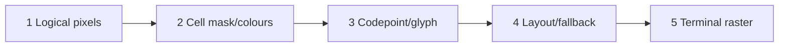
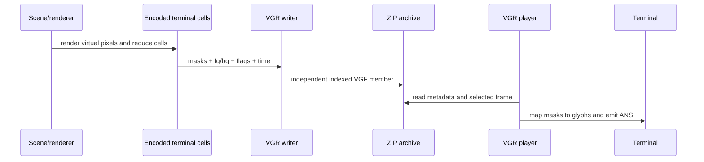

# Architecture and data flow

## System overview



## Repository and runtime boundaries



The font repository and FontPlotter are not currently one Git repository.
FontPlotter carries copies of the active font files for its isolated Linux
profile. Keep their hashes synchronized explicitly.

## Coordinate systems

### Virtual pixels

Public graphics coordinates are zero-based, increase left-to-right and
top-to-bottom, and are independent of the terminal cursor.

### Terminal cells

For mode 4:

```text
cell column = virtual_x // 4
cell row    = virtual_y // 4
local x     = virtual_x % 4
local y     = virtual_y % 4
```

For mode 2, only the horizontal divisor/modulus changes to two. Both modes
have four virtual rows per terminal row.

### ANSI cursor positions

ANSI cursor positions are one-based:

```text
ANSI column = cell column + 1
ANSI row    = cell row + 1
```

They are output coordinates only. Do not expose them as framebuffer restore or
primitive coordinates.



## 4x4 encode and decode chain

For every occupied virtual pixel in a cell:

```text
bit = 4 * local_y + (3 - local_x)
mask = mask OR (1 << bit)
```

Then:

```text
mask < 0x8000  -> U+F0000 + mask
mask >= 0x8000 -> U+100000 + mask - 0x8000
```

Decode reverses those steps:

```text
Part 0 mask = codepoint - U+F0000
Part 1 mask = 0x8000 + codepoint - U+100000

local_y = bit // 4
local_x = 3 - (bit % 4)
```

## Rendering layers

Keep these layers distinct during diagnosis:

1. **Logical image** — per-virtual-pixel occupancy, colour and depth.
2. **Cell encoding** — one mask, foreground and optional background per
   terminal cell.
3. **Font mapping** — mask to codepoint to glyph outline and metrics.
4. **Text layout** — wcwidth, shaping, fallback selection, advance and line
   box.
5. **Raster/compositing** — hinting, antialiasing, clipping, paint order, DPI,
   point size and zoom.



When a screenshot is wrong, capture evidence at every boundary. A correct
mask printed in a dashboard proves layers 1-2, not layers 3-5.

## Font fallback architecture

The 2x4 font contains text and graphics in one face. The 4x4 pair contains
graphics only and therefore requires an ordered fallback stack:

```text
Square Braille Unicode Text Seamless
  -> PUA 4x4 Part 0
  -> PUA 4x4 Part 1
```

Linux uses a Fontconfig alias and an isolated MATE profile. WezTerm is the
reference explicit fallback configuration for macOS/Windows experiments.
Installing files alone does not guarantee that a terminal selects them.

## Recording architecture



VGR stores already rasterized terminal-cell state, not model geometry and not
a video. Playback still needs the matching font mode and a sufficiently large
terminal.
