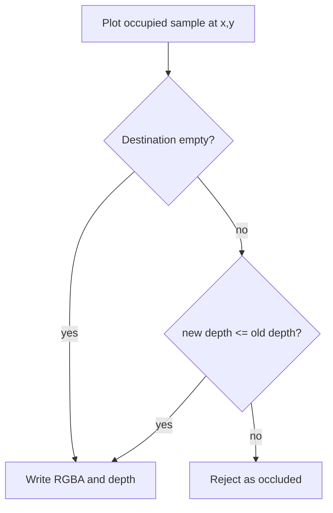
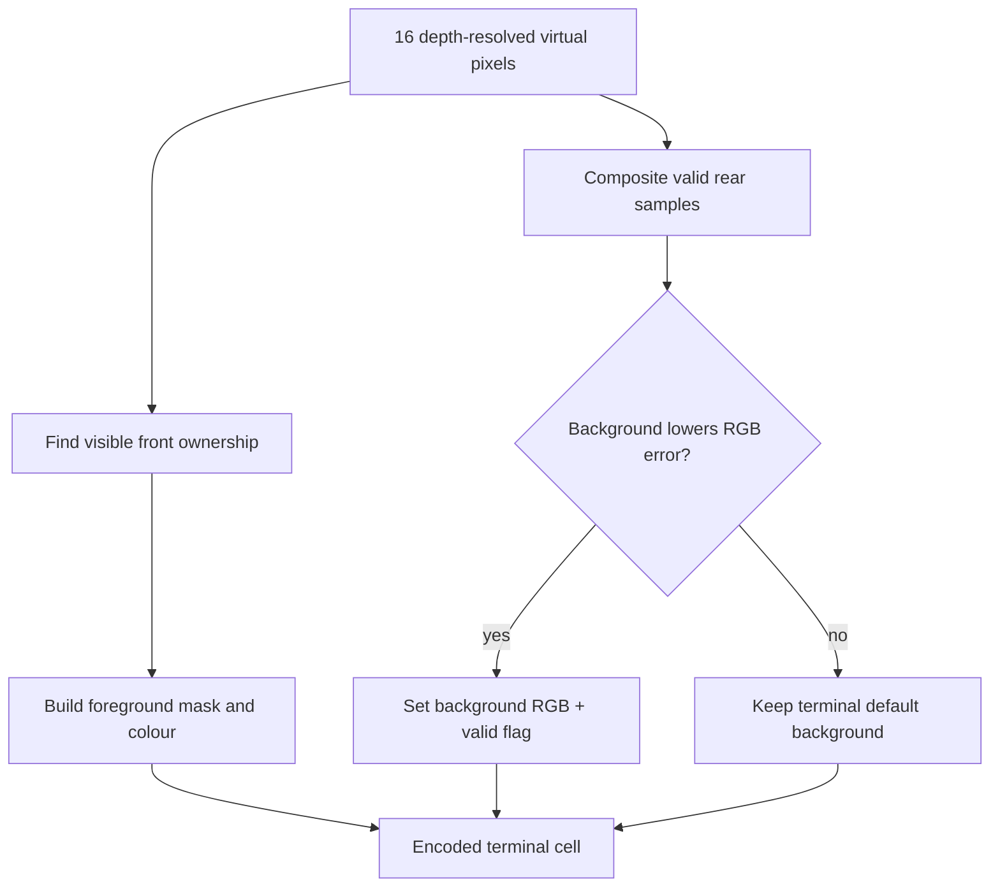

# Rendering, framebuffer and VGR

## Why FontPlotter exists

The original demos assembled a cell mask and assigned one foreground colour.
That works for sparse monochrome plots, but it loses detail when two coloured
objects occupy different virtual pixels in one cell. The clearest example was
Voyager crossing a filled planet: ORing spacecraft and planet occupancy could
produce a full glyph in one colour.

FontPlotter separates scene truth from terminal encoding:

```text
scene truth: per virtual pixel occupancy + RGBA + depth
terminal cell: one mask + one foreground + optional background
```

## Per-pixel data

Each virtual pixel currently has three base planes:

| Plane | Bytes | Purpose |
|---|---:|---|
| occupancy | 1 | distinguishes empty from opaque black |
| RGBA | 4 | straight RGBA8888 colour |
| depth | 4 | float32; smaller is nearer |

Base allocation is nine bytes per virtual pixel. Empty state is unoccupied,
RGBA `00000000`, depth positive infinity.

There is one visible sample per virtual location, not a stack of every depth
ever plotted. A normal depth-aware plot replaces the current sample when the
new depth is nearer or equal; a farther sample is rejected. `set-pixel` is the
explicit unconditional override.

## Depth-aware plotting



Equal-depth later-write-wins is deliberate and deterministic. A line can
traverse depth by interpolating a depth value along its parameter, although a
general line primitive remains part of the pending primitive layer rather
than the current core service API.

## Two-colour terminal-cell reduction

The nearest visible layer supplies the foreground occupancy mask and mean
foreground RGB. Lower layers are composited in depth order. A candidate rear
mean RGB is used as the terminal background only if it reduces the complete
cell reconstruction error.



Important constraints:

- foreground/background are properties of one terminal cell;
- depth and colour are properties of virtual pixels before reduction;
- a sparse distant star must not flood an otherwise black cell;
- a full single-colour cell remains foreground mask `0xFFFF`;
- ring segments behind a planet must be occluded, while near segments remain
  visible;
- no reverse-video special case is permitted.

## RAM framebuffer service

The service is a long-running ordinary-user process. Separate CLI invocations
connect over a Unix-domain socket and operate on named buffers that remain in
RAM after the clients exit. Nothing is persisted automatically.

Implemented and tested:

- create/list/info/delete named buffers;
- set/get/plot/erase pixels;
- native bulk pixels and depth-aware rectangle fill/erase;
- persistent streams and atomic/non-atomic batches;
- revisions and bounded RAM timing/debug logs;
- aligned compact viewport encoding for 2x4 and 4x4;
- complete terminal-cell backups with foreground/background metadata;
- backup list/show/copy/move/delete/export;
- translated reusable restore with `replace`, `plot` and `or` policies;
- operation-created backups and restore-of-restore;
- live terminal dump, visual blitter lab, Asteroids and box diagnostic.

## Backup semantics

A backup request uses inclusive virtual bounds but expands them to every
intersected complete terminal cell. It stores all virtual pixels including
blanks, plus exact cell mask, glyph, codepoint, foreground, background,
background-valid and flags.

Restore policies:

| Policy | Source blanks | Depth test | Occupied overlap | Exact prior composite? |
|---|---|---|---|---|
| `replace` | copied; can erase | no | source replaces | yes when restoring saved state |
| `plot` | ignored | yes | nearer/equal source wins | not generally |
| `or` | ignored | no | source occupancy/metadata wins | not generally |

Public destination coordinates are zero-based virtual pixels. Cell-aligned
replacement can reinstall exact terminal-cell metadata. Unaligned restores
retain exact pixels but invalidate stale cell encoding so it can be derived at
the new boundaries.

## Performance architecture

The service model adds IPC overhead, but avoids repeatedly constructing large
Python objects and enables shared state. The unacceptable path is one CLI
process per pixel. Current measurements show native bulk operations are orders
of magnitude faster.

Current measured baseline retained in FontPlotter docs:

| Path | Linux | macOS |
|---|---:|---:|
| fresh CLI per operation | about 30 ops/s | about 18 ops/s |
| one connection per request | about 10k ops/s | about 19k ops/s |
| one 1000-command batch | about 77k ops/s | about 92k ops/s |
| native 1000-pixel bulk request | about 244k px/s | about 299k px/s |

These are baselines, not final performance guarantees. Terminal output should
coalesce ANSI colour changes and write complete runs in as few writes as
possible. Delta-only blitting is pending.

## VGR formats

### VGR v1

- Implemented in the Square Braille repository's Voyager tools.
- ZIP archive with `metadata.json` and independent `VGF1` frame members.
- Stores masks and foreground RGB.
- Supports mode 2 and mode 4, indexed replay, CRC and streaming.

### VGR v2

- Implemented in FontPlotter.
- Packet magic `VGF2`.
- Adds background RGB and flags planes.
- Flag bit zero indicates valid background colour.
- Legacy v1 packets decode with no valid background.

```text
VGF2 header
  -> mask plane
  -> foreground RGB plane
  -> background RGB plane
  -> flags plane
```

VGR records terminal-cell frames, not source models. A capture does not need
to display the full rendering dashboard, but its requested columns/rows define
the stored frame dimensions. Playback does not rescale; the terminal must be
large enough or output is clipped.

## Capture timing

- Deterministic Grand Tour capture: requested FPS is the animation sampling
  rate; frames render as fast as possible without sleeping.
- Interactive model-view recording: a frame is appended only after a completed
  redraw; metadata stores achieved frame count divided by real elapsed time.
- Repetitive frames compress heavily. File size alone is not evidence of
  missing recording time.

## Current framebuffer boundaries

Pending or incomplete:

- general line, circle, ellipse, triangle, polygon and flood-fill primitives;
- named FIFO block queues distinct from backups;
- undo/redo stacks with explicit memory limits;
- framebuffer save/load file format and import;
- arbitrary unaligned raw viewport extraction and clipping policy;
- arbitrary terminal destination placement and delta-only output;
- concurrent clients and transaction ordering;
- second-user authorization tests;
- Windows named-pipe transport.
