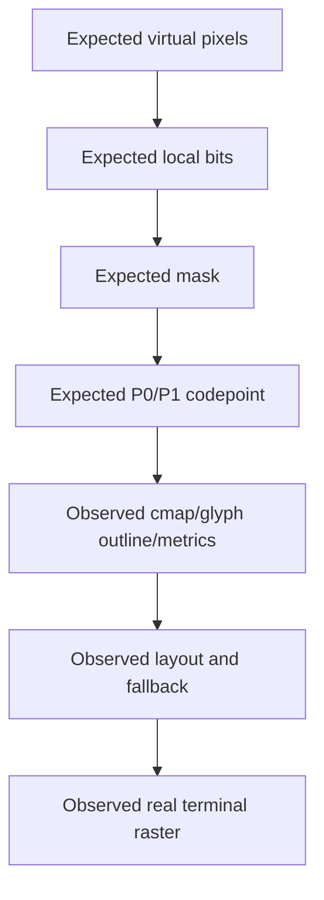

# AI operating protocol

Use this protocol when an AI resumes the project without conversational
memory.

## First 15 minutes

1. Read this handover package in order.
2. Run `git status --short`, `git log -8 --oneline --decorate` and
   `git diff --stat` in the Square repository.
3. Do not alter or delete untracked files.
4. Confirm whether the task concerns:
   - released Square Braille 2x4;
   - experimental PUA 4x4;
   - Voyager/VGR;
   - FontPlotter framebuffer service.
5. Read the specific current document listed in the document register.
6. Reproduce the smallest relevant existing test before editing.

## Reasoning discipline

For every defect, build this evidence chain:



Stop at the first mismatch. Do not regenerate a font when the first mismatch
is in renderer arithmetic. Do not rewrite renderer arithmetic when the mask
and codepoint are right but glyph placement is wrong.

## Claims discipline

- Say **mathematics verified** only when encode and inverse decode were tested
  exhaustively or against a clearly bounded complete set.
- Say **font geometry verified** only when cmap, metrics, bearings, outline and
  hashes were checked.
- Say **terminal verified** only after the target terminal, point size and zoom
  were actually tested.
- Say **cross-platform** only when all named platforms passed equivalent tests.
- A Pango screenshot is not a MATE Terminal screenshot.
- A profile name is not proof of the active font; query the selected family or
  PostScript name.

## Mutation rules

- Use side-by-side names for every font candidate.
- Build into a new directory and compare before packaging.
- Never modify released 2x4 assets as a shortcut for a 4x4 problem.
- Never use reverse video or background colour to impersonate `0xFFFF`.
- Preserve user changes and unrelated dirty files.
- Do not commit generated caches, third-party meshes or captured recordings
  until their licensing and size policy is explicit.
- Do not push a broad dirty tree without presenting the proposed commits.

## Testing rules

- Run fast mathematical/unit tests first.
- Run font binary/hash/layout tests second.
- Run headless raster tests third.
- Run real terminal visual tests last, but never omit them for a visual claim.
- If Unix socket tests fail with `Operation not permitted`, identify sandbox
  denial and rerun with ordinary-user socket permission.
- Capture both expected and observed output; retain failures as evidence when
  they explain a design decision.

## Communication rules

- Lead with the concrete outcome.
- Give exact commands when the user asks how to run something.
- Separate established fact, inference and recommendation.
- Do not overwhelm a step-by-step review with future implementation detail.
- If the user supplies a screenshot contradicting a PASS, acknowledge the
  contradiction, reproduce it and refine the test boundary.
- A beautiful dashboard is secondary to readable text, accurate statistics
  and correct rendering.

## Common traps already encountered

1. Assuming `fc-match` means the terminal is actively using that font.
2. Confusing official Unicode Braille mapping with the project-defined 4x4 bit
   order.
3. Using `local_x` directly instead of `3-local_x` for 4x4.
4. Inspecting raw outline bounds while ignoring TrueType side bearings.
5. Solving seams with horizontal overhang and thereby breaking neighbouring
   colour ownership.
6. Treating full-cell background as equivalent to a full foreground glyph.
7. Calling a requested FPS the achieved render FPS.
8. Expecting VGR playback to rescale to the terminal.
9. Treating `plot` or `or` restore as exact replacement.
10. Diagnosing twenty socket-test failures independently when service startup
    was blocked once by the sandbox.

## Safe continuation template

Before implementing a new candidate or subsystem change, write:

```text
Invariant:
Expected mathematical result:
Current observed result:
First layer where they differ:
Proposed smallest change:
Artifacts preserved:
Automated proof:
Real-terminal proof:
Rollback/side-by-side route:
Documentation affected:
```

This template captures the user's preferred evidence-first process and reduces
the risk of another visually plausible but architecturally incorrect fix.
