# Diagram atlas

This atlas is the visual index for the complete handover. The prose documents
remain authoritative for exact commands, hashes and limitations; these
diagrams show how the decisions and components relate.

## 1. Evolution of the project

```mermaid
flowchart LR
    A["Unicode Braille U+2800-U+28FF"] --> B["2x4 square-dot experiment"]
    B --> C["PUA 2x4 mapping U+E000-U+E0FF"]
    C --> D["Seamless Unicode 2x4 text font"]
    D --> E["Terminal graphics demos and VGR v1"]
    E --> F["PUA 4x4: 65,536 masks"]
    F --> G["Two-font P0/P1 split"]
    G --> H["Candidate lineage and raster audits"]
    H --> I["Candidate 6 Linux RC"]
    I --> J["Depth and two-colour composition"]
    J --> K["FontPlotter RAM framebuffer service"]
    K --> L["Backups, blits, diagnostics and VGR v2"]
```

## 2. Repository, runtime and display boundary

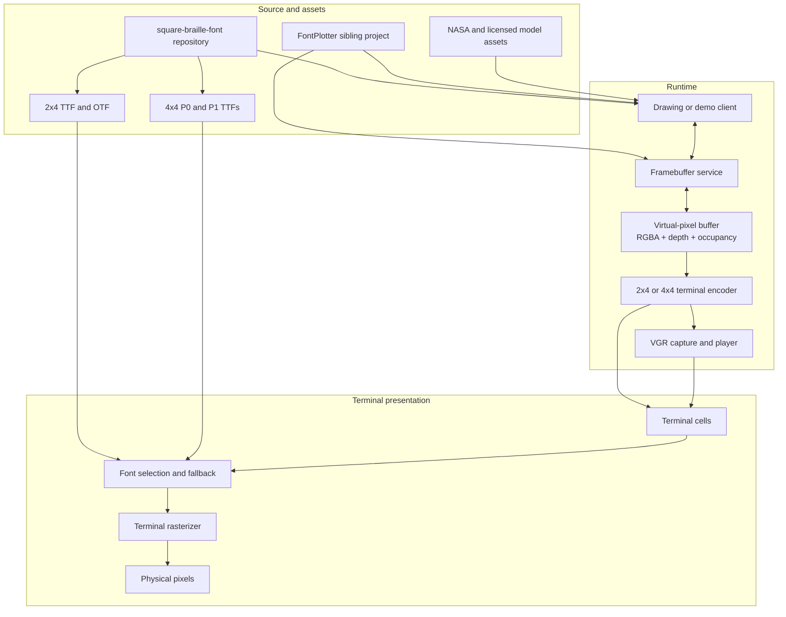

## 3. A terminal cell becomes a virtual-pixel grid

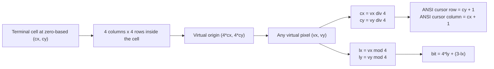

An 80-column by 24-row terminal therefore exposes a virtual canvas of
`320 x 96` addressable pixels when the 4x4 family is active.

## 4. Exact 4x4 bit layout

The display coordinates increase left-to-right and top-to-bottom. Within each
row, the numeric bit significance is MSB-left:

```text
local x       0       1       2       3
local y 0   bit 3   bit 2   bit 1   bit 0
local y 1   bit 7   bit 6   bit 5   bit 4
local y 2  bit 11  bit 10   bit 9   bit 8
local y 3  bit 15  bit 14  bit 13  bit 12
```

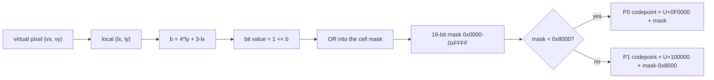

The inverse path recovers the mask from the selected P0 or P1 codepoint and
tests bit `b` to determine whether local pixel `(lx, ly)` is active.

## 5. Why the 4x4 family needs two fonts

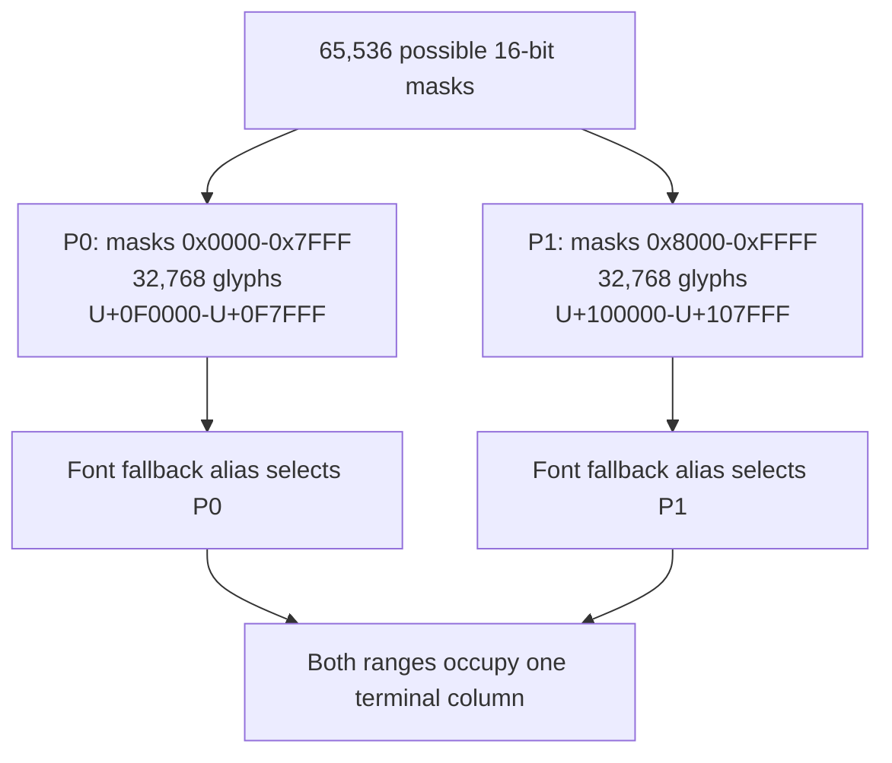

The split is a mapping and packaging boundary. It does not change the 16-bit
mask or the drawing mathematics.

## 6. Candidate lineage and evidence gates

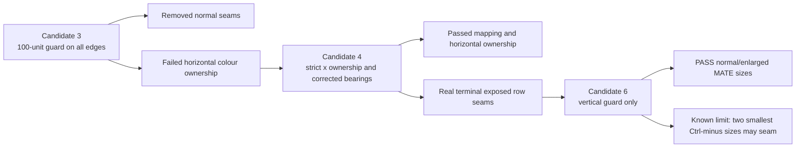

The release gate always includes the real terminal. Outline bounds, FreeType
and Pango are necessary evidence, but none can prove final raster behaviour by
itself.

## 7. Raster diagnosis layers

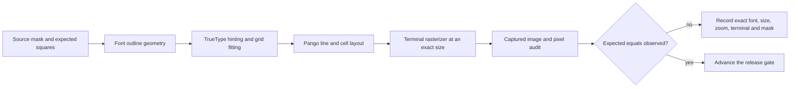

## 8. Depth-aware, two-colour reduction

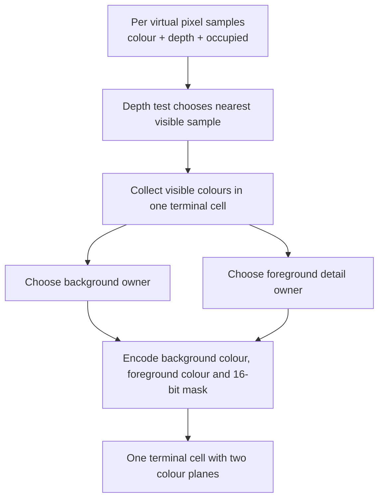

This policy avoids blindly OR-ing a foreground spacecraft into an already
full planet cell. It deliberately preserves the nearer detail, while accepting
that a terminal cell can display at most one foreground mask plus one
background colour.

## 9. Persistent RAM framebuffer and reversible operations

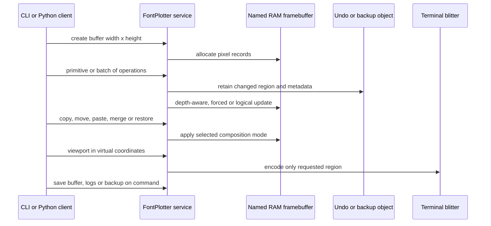

The service exists so separately invoked clients can share one live memory
buffer. Files are persistence checkpoints, not the normal working store.

## 10. VGR capture and replay

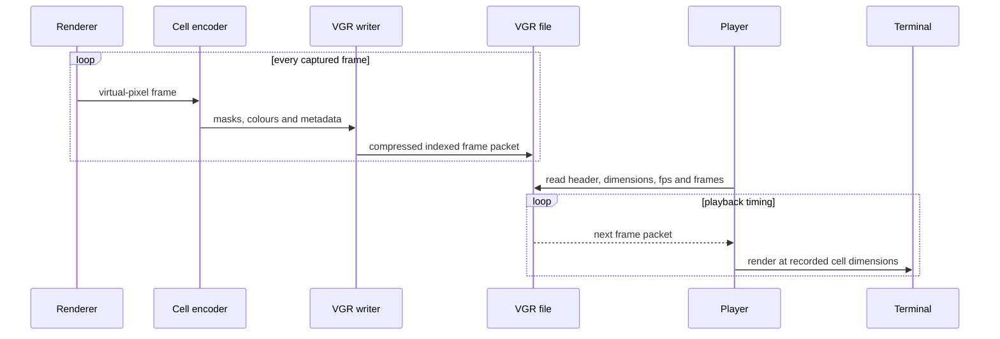

VGR stores rendered terminal-frame data and timing metadata. It is not a video
codec and it is not a raw 3D scene. A recording that contains only a few frames
will remain small regardless of how long a process stayed alive; this is why
frame count and capture progress must be monitored independently of elapsed
wall time.

## 11. Current priorities and proof gates

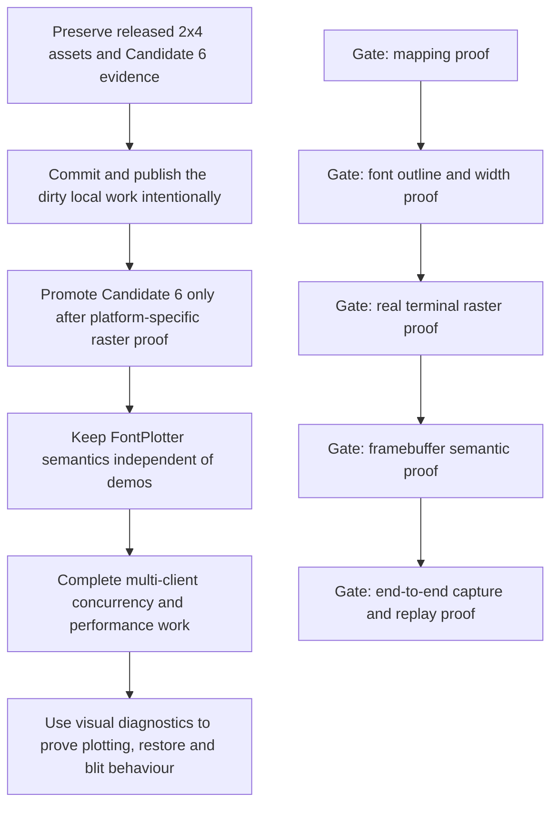

The first rule for the next collaborator is to preserve evidence. Do not clean
the worktree, overwrite historical candidates or replace a real-terminal
observation with an inferred claim.
